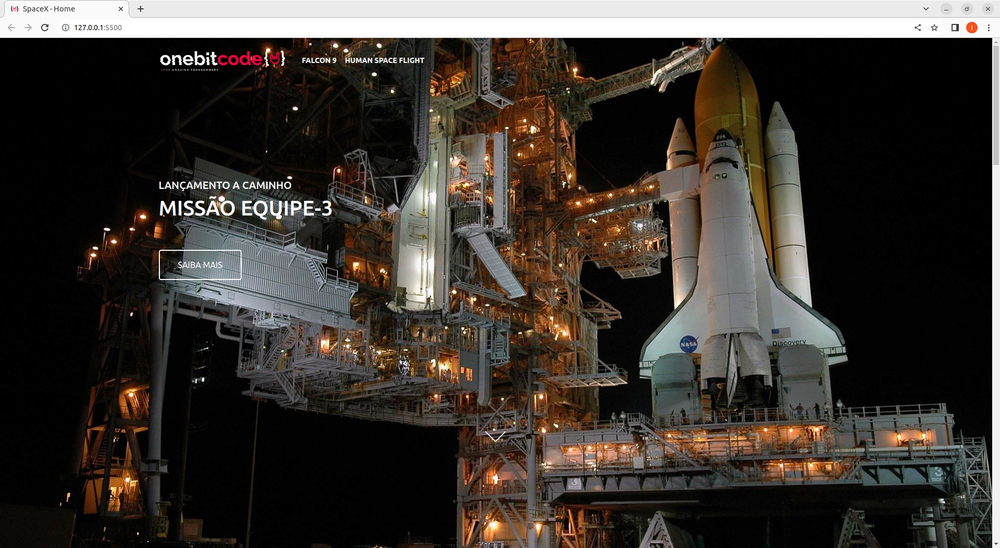
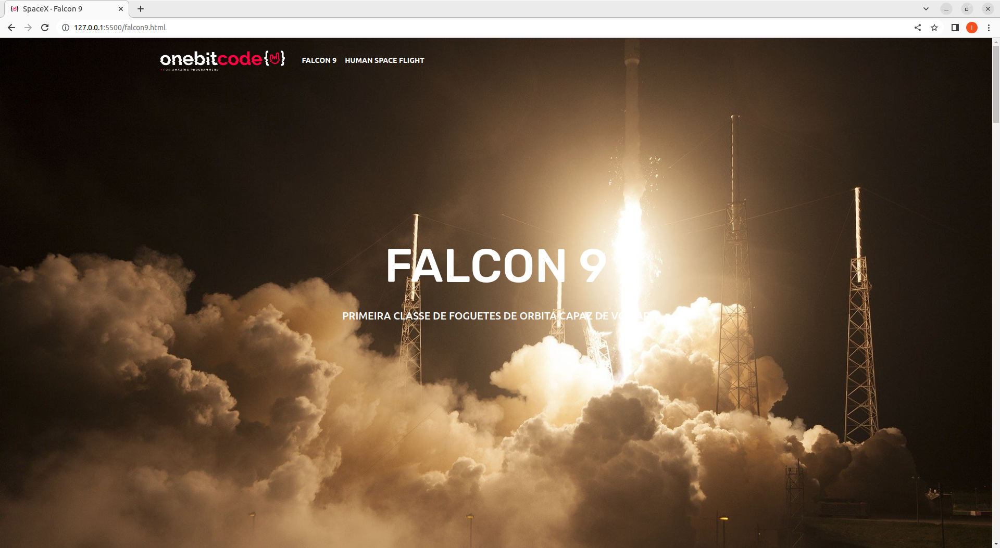
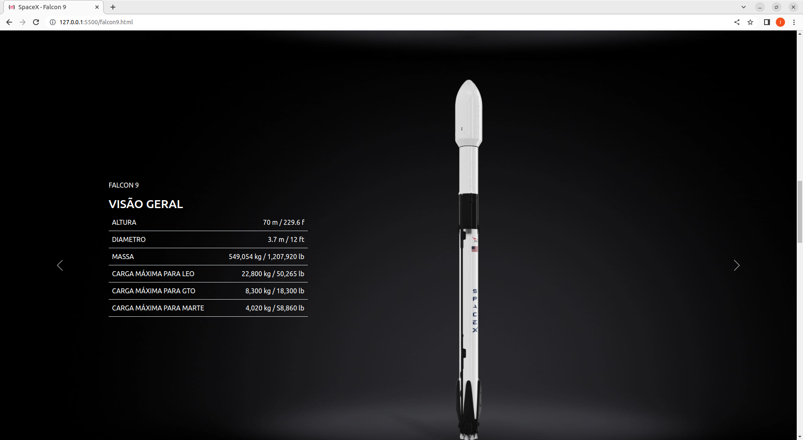
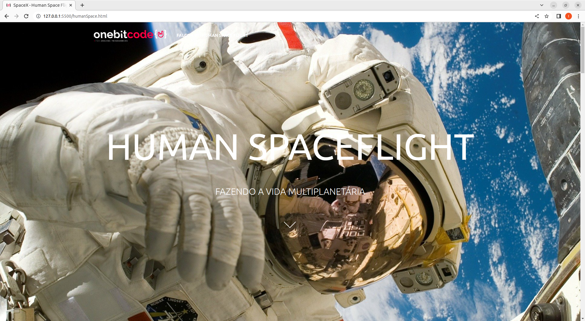

# SpaceX: 
Uma single page construida para o modulo de Bootstrap do curso OnebitCode. Onde tivemos que construir uma aplicação identica ao site da SpaceX

# Tecnologias utilizadas no projeto: 
<ul>
    <li> HTML5 </li>
    <li> CSS5</li>
    <li> SASS </li>
    <li> BootStrap </li>
</ul>

# Requisitos para rodar na sua maquina: 
<ul>
    <li> Possuir o VSCode instalado </li>
</ul>

# Como rodar na sua maquina? 

 Como a aplicação é apenas para front-end, so é necessario ir na pagina index.html e rodar o projeto na sua localhost utilizando live-server ou algum derivado dele  

# Imagens: 

<h3><strong> Index:</strong> </h3>

<h3><strong> Falcon 9:</strong> </h3>

<h3><strong> Human space flight:</strong> </h3>

